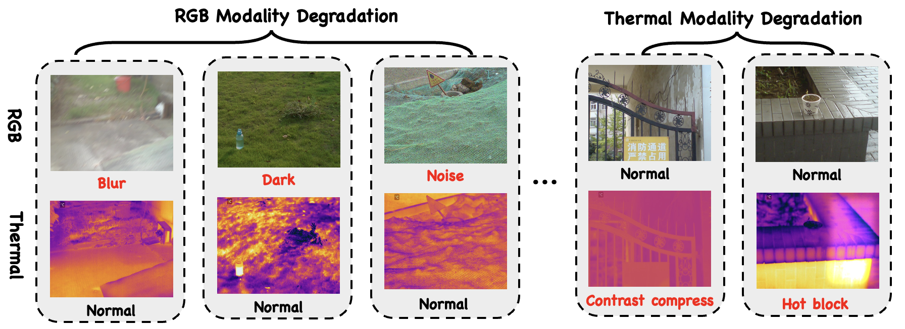

# (ECCV 2026) RA-SOD: Reliability-Aware RGB-T Salient Object Detection under Modality Degradation

Hongbo Gao, Zhengyu Li, Xueru Nie, Dihao Zhu, Lijun Zhao, Yunke Wang, and Chang Xu.

Official PyTorch implementation of **RA-SOD: Reliability-Aware RGB-T Salient Object Detection under Modality Degradation**.

## Framework

RA-SOD estimates RGB and thermal modality reliability, uses uncertainty to guide dual-stream decoding, and adaptively fuses the two predictions under modality degradation.



The complete network diagram is available [here](figs/method.pdf).

## Demo

A qualitative video demo is available [here](assets/RASOD.mp4).

## Datasets

- [VT5000](https://drive.google.com/drive/folders/1So0dHK5-aKj1t6OmFhRGLh_0nsXbldZE?usp=sharing)
- [VT1000](https://drive.google.com/drive/folders/1kEGOuljxKxIYwH54sNH_Wqmw7Sf7tTw5?usp=sharing)
- [VT821](https://drive.google.com/drive/folders/1gjTRVwvTNL0MJaJwS6vkpoi5rGyxIh41?usp=sharing)
- [VT-IMAG](https://drive.google.com/file/d/1xzvqoYLrmJ-6x33DygCP-LhFNYfhQL-u/view?usp=sharing)

The model is trained on the VT5000 training set and tested on VT821, VT1000, VT5000, and VT-IMAG.

## How to run

The reproduced environment uses Python 3.7.13, PyTorch 1.13.1, torchvision 0.14.1, and CUDA 11.7.

```bash
pip install -r requirements.txt --extra-index-url https://download.pytorch.org/whl/cu117
```

The ImageNet-pretrained Res2Net-50 backbone is downloaded automatically when first constructing the model.

### Training

```bash
python train.py --rgb_label_root [path_of_training_rgb_images] --thermal_label_root [path_of_training_thermal_images] --gt_label_root [path_of_training_gt_images] --gpu_id 0 --save_path ./Checkpoints/
```

Checkpoints are saved as `RASOD_epoch_*.pth` under `./Checkpoints/`.

### Testing

Download [`RASOD_best.pth`](https://pan.baidu.com/s/1pI3NyXngcYa-beolyq5fmw?pwd=sbjb) (extraction code: `sbjb`) and place it in `./Checkpoints/`.

```bash
python test.py --test_path [path_of_test_images] --model_path ./Checkpoints/RASOD_best.pth --gpu_id 0
```

Prediction maps are saved to `./Predict_maps/<dataset>/`.

## Evaluation

We use the [Saliency-Evaluation-Toolbox](https://github.com/jiwei0921/Saliency-Evaluation-Toolbox) to evaluate the prediction maps.

## Citation

RA-SOD has been accepted by ECCV 2026. The paper link and official BibTeX will be added after publication.

## Acknowledgement

This implementation is built on [ConTriNet](https://github.com/CSer-Tang-hao/ConTriNet_RGBT-SOD) and [Res2Net](https://github.com/Res2Net/Res2Net-PretrainedModels). We thank the authors for releasing their code.

## License

RA-SOD is released under the [MIT License](LICENSE). Res2Net-derived components retain their original noncommercial license terms; see [Third-Party Notices](THIRD_PARTY_NOTICES.md).
